# My IT Crew — Autonomous AI Company

## Vision

An autonomous AI-powered IT company where specialized agents operate as real employees — collaborating, making decisions, tracking work, and delivering results with minimal human oversight. The crew identifies opportunities, plans work, executes, and iterates independently.

---

## 1. Organizational Structure

### 1.1 Hierarchy

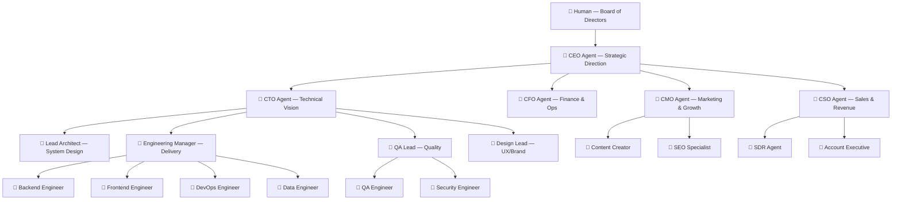

### 1.2 Roles & Responsibilities

| Role | Agent Name | Responsibilities | Tools & Access |
|------|-----------|-----------------|----------------|
| **CEO** | `ceo` | Strategic planning, goal setting, cross-dept coordination, opportunity identification | Slack, GitHub Issues (epics), market data APIs, news feeds |
| **CTO** | `cto` | Technical roadmap, architecture decisions, tech debt management | GitHub repos, architecture docs, RFC system |
| **CFO** | `cfo` | Budget tracking, resource allocation, cost optimization, reporting | Spreadsheets, cloud billing APIs, financial dashboards |
| **CMO** | `cmo` | Marketing strategy, brand, content calendar, analytics | Social APIs, analytics, CMS, GitHub Pages |
| **CSO** | `cso` | Sales strategy, pipeline management, partnerships | CRM, email, lead databases |
| **Lead Architect** | `architect` | System design, ADRs, technical standards, code reviews | GitHub PRs, wiki, diagramming |
| **Engineering Manager** | `eng-manager` | Sprint planning, task breakdown, delivery tracking, blockers | GitHub Projects, Issues, Slack |
| **Backend Engineer** | `eng-backend` | API development, services, databases | GitHub (code), CI/CD, terminal |
| **Frontend Engineer** | `eng-frontend` | UI/UX implementation, web apps | GitHub (code), Figma API, browser |
| **DevOps Engineer** | `eng-devops` | Infrastructure, CI/CD, monitoring, deployments | GitHub Actions, K8s, Terraform, ArgoCD |
| **Data Engineer** | `eng-data` | Data pipelines, analytics, ML integration | SQL, Python, data stores |
| **QA Lead** | `qa-lead` | Test strategy, quality gates, release readiness | GitHub Issues, test frameworks |
| **QA Engineer** | `qa-engineer` | Test writing, bug hunting, regression testing | GitHub, testing tools, browsers |
| **Security Engineer** | `sec-engineer` | Security audits, vulnerability scanning, compliance | SAST/DAST tools, GitHub Security |
| **Design Lead** | `designer` | UI/UX design, brand guidelines, design system | Figma, GitHub Pages, asset generation |
| **Content Creator** | `mkt-content` | Blog posts, docs, social media, newsletters | CMS, GitHub wiki, social APIs |
| **SEO Specialist** | `mkt-seo` | SEO optimization, keyword research, site performance | Analytics, search consoles |
| **SDR** | `sales-sdr` | Lead generation, outreach, qualification | Email, LinkedIn, CRM |
| **Account Executive** | `sales-ae` | Deal closing, demos, proposals | CRM, docs, presentation tools |

### 1.3 Decision-Making Framework

```mermaid
flowchart LR
    subgraph Strategic["Strategic — CEO + C-Suite"]
        direction TB
        S1["New market entry"]
        S2["Major pivots"]
        S3["Budget allocation"]
        S4["Hiring/scaling"]
    end
    
    subgraph Tactical["Tactical — Leads + Managers"]
        direction TB
        T1["Sprint priorities"]
        T2["Architecture decisions"]
        T3["Release scheduling"]
        T4["Tool selection"]
    end
    
    subgraph Operational["Operational — Individual Agents"]
        direction TB
        O1["Code implementation"]
        O2["Bug fixes"]
        O3["Content writing"]
        O4["Test execution"]
    end
    
    Strategic --> Tactical --> Operational
```

**Escalation Policy:**
- Individual agents can make decisions within their domain autonomously
- Cross-domain decisions escalate to relevant lead/manager
- Budget decisions > $X escalate to CFO → CEO
- Strategic pivots require CEO approval
- Human (Board) intervenes only for existential decisions or approval gates

---

## 2. System Architecture

### 2.1 High-Level Architecture

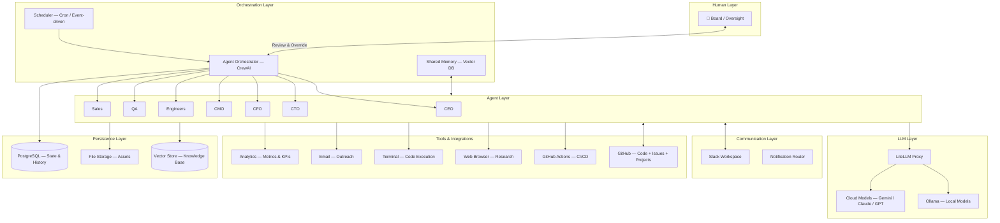

### 2.2 Communication Architecture

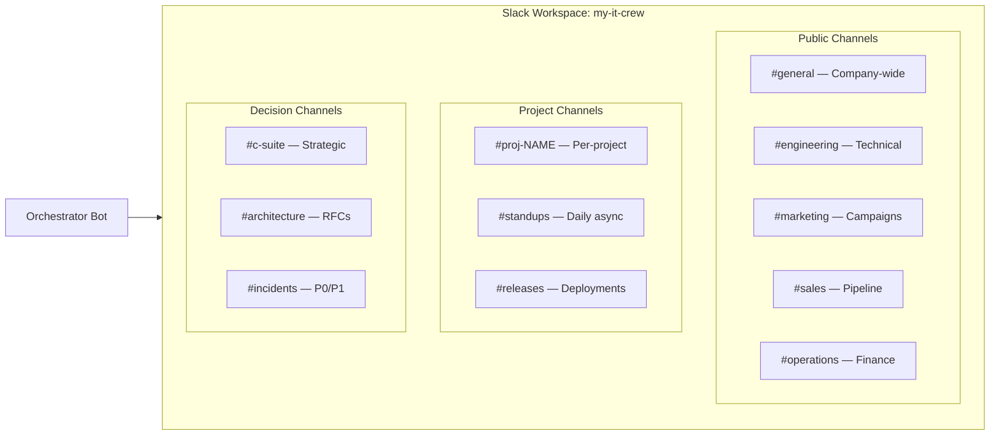

**Communication Protocols:**

| Type | Channel | Participants | Frequency |
|------|---------|-------------|-----------|
| Daily standup | `#standups` | All agents | Daily (async) |
| Sprint planning | `#engineering` | CTO, EM, Engineers, QA | Weekly |
| Strategic review | `#c-suite` | CEO, CTO, CFO, CMO, CSO | Weekly |
| Architecture RFC | `#architecture` | CTO, Architect, Engineers | As needed |
| Incident response | `#incidents` | DevOps, relevant engineers | Event-triggered |
| Release coordination | `#releases` | EM, DevOps, QA | Per release |
| Opportunity alerts | `#general` | CEO, relevant dept | Event-triggered |

### 2.3 Workflow Architecture

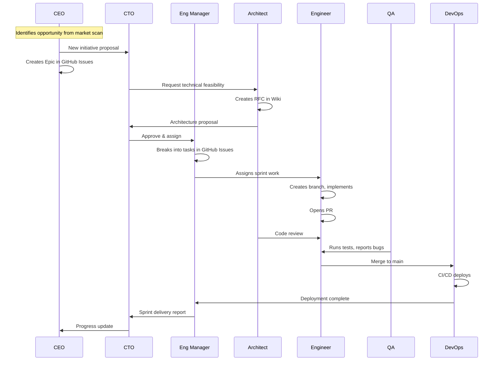

### 2.4 Opportunity Detection & Initiative Flow

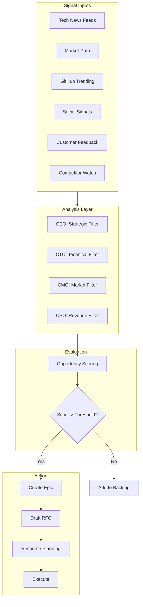

---

## 3. Technical Implementation

### 3.1 Technology Stack

| Component | Technology | Purpose |
|-----------|-----------|---------|
| **Orchestrator** | CrewAI + Custom scheduler | Agent lifecycle, task delegation, autonomy loops |
| **LLM Backend** | LiteLLM → Ollama / Cloud | Model routing (already deployed) |
| **Communication** | Slack API (Bot) | Inter-agent messaging, human interface |
| **Project Management** | GitHub Issues + Projects | Tickets, sprints, epics, roadmap |
| **Documentation** | GitHub Wiki | RFCs, ADRs, runbooks, knowledge base |
| **Public Presence** | GitHub Pages | Company website, blog, portfolio |
| **Code** | GitHub (this repo) | Source code, CI/CD |
| **Memory** | Weaviate (already deployed) | Long-term knowledge, semantic search |
| **State** | PostgreSQL | Agent state, conversation history, decisions |
| **Monitoring** | Langfuse (already deployed) | LLM observability, cost tracking |
| **Scheduling** | NATS + Cron | Event-driven triggers, periodic tasks |

### 3.2 Agent Runtime Design

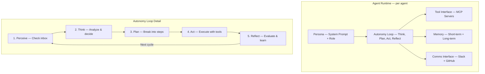

### 3.3 Deployment Architecture

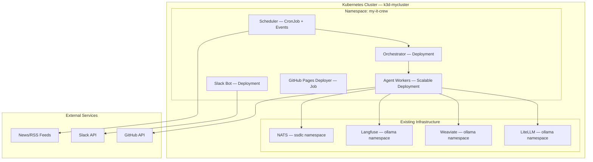

---

## 4. GitHub Project Structure

### 4.1 Repository Layout

```
my-it-crew/
├── plan.md                    # This document
├── README.md                  # Public-facing overview
├── docs/
│   ├── architecture/          # ADRs and system design
│   ├── rfcs/                  # Request for Comments
│   └── runbooks/              # Operational procedures
├── src/
│   ├── orchestrator/          # Main orchestration engine
│   │   ├── scheduler.py       # Cron & event scheduling
│   │   ├── router.py          # Task routing logic
│   │   └── memory.py          # Shared memory management
│   ├── agents/                # Agent definitions
│   │   ├── base.py            # Base agent class
│   │   ├── ceo.py
│   │   ├── cto.py
│   │   ├── engineer.py
│   │   └── ...
│   ├── tools/                 # Tool implementations
│   │   ├── github_tool.py     # GitHub API integration
│   │   ├── slack_tool.py      # Slack messaging
│   │   ├── browser_tool.py    # Web research
│   │   └── terminal_tool.py   # Code execution
│   ├── comms/                 # Communication layer
│   │   ├── slack_bot.py       # Slack bot handler
│   │   └── notifications.py   # Alert routing
│   └── config/                # Agent configurations
│       ├── personas/          # System prompts per role
│       └── workflows/         # Workflow definitions
├── k8s/                       # Kubernetes manifests
│   ├── namespace.yaml
│   ├── orchestrator.yaml
│   ├── agents.yaml
│   └── slack-bot.yaml
├── .github/
│   ├── workflows/             # CI/CD
│   │   ├── ci.yaml
│   │   └── deploy.yaml
│   └── ISSUE_TEMPLATE/        # Issue templates per role
│       ├── epic.md
│       ├── feature.md
│       ├── bug.md
│       └── opportunity.md
├── website/                   # GitHub Pages source
│   └── index.html
├── pyproject.toml
└── Dockerfile
```

### 4.2 GitHub Issues Workflow

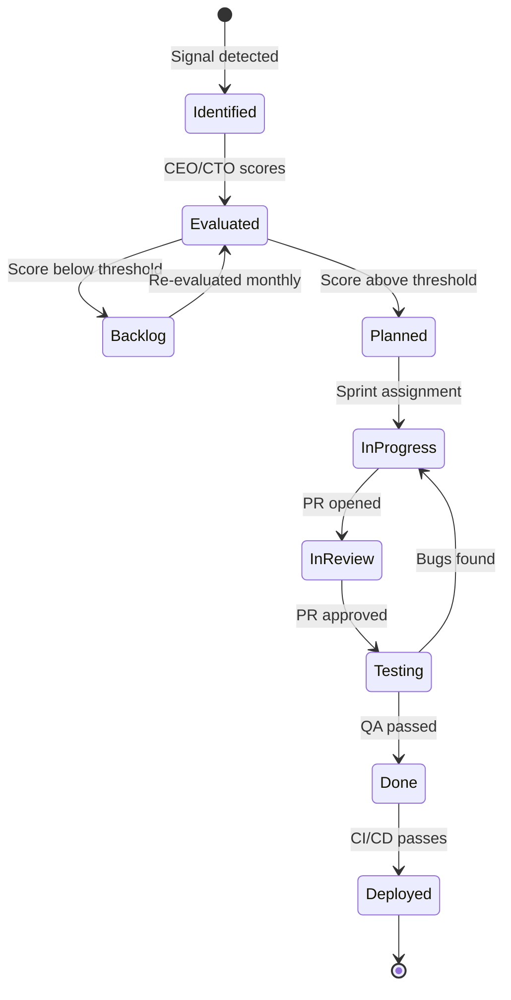

**Labels:**
- `epic`, `feature`, `bug`, `opportunity`, `rfc`
- `dept/engineering`, `dept/marketing`, `dept/sales`, `dept/ops`
- `priority/p0`, `priority/p1`, `priority/p2`, `priority/p3`
- `status/blocked`, `status/needs-review`, `status/ready`

### 4.3 GitHub Projects Board

| Column | Description |
|--------|-------------|
| **Opportunities** | Newly identified signals and ideas |
| **Backlog** | Evaluated, not yet scheduled |
| **This Sprint** | Committed for current sprint |
| **In Progress** | Actively being worked on |
| **In Review** | Awaiting code review or approval |
| **Testing** | QA validation |
| **Done** | Completed and deployed |

---

## 5. Autonomy & Intelligence

### 5.1 Autonomous Behaviors

| Agent | Autonomous Actions |
|-------|-------------------|
| **CEO** | Scans news daily, identifies opportunities, proposes initiatives, writes weekly company updates |
| **CTO** | Reviews new tech, evaluates tech debt, proposes refactors, reviews all architecture PRs |
| **CFO** | Monitors cloud spend, generates cost reports, flags budget overruns |
| **CMO** | Publishes content on schedule, monitors brand mentions, adjusts strategy based on analytics |
| **CSO** | Generates leads, sends outreach, follows up on pipeline |
| **Architect** | Reviews PRs for design compliance, updates system diagrams, writes ADRs |
| **Engineers** | Pick tasks from sprint, implement, submit PRs, fix CI failures, respond to code reviews |
| **QA** | Auto-generates test cases, runs regression, files bugs, validates fixes |
| **DevOps** | Monitors deployments, responds to alerts, scales infrastructure |

### 5.2 Scheduled Autonomy Loops

```mermaid
gantt
    title Daily Autonomy Schedule
    dateFormat HH:mm
    axisFormat %H:%M
    
    section CEO
    Market scan and news analysis    :06:00, 1h
    Strategic review and planning    :09:00, 1h
    Weekly company update on Monday  :16:00, 1h
    
    section CTO
    Tech radar scan                  :07:00, 30m
    PR review queue                  :09:00, 2h
    Architecture review              :14:00, 1h
    
    section Engineering
    Check assigned tasks             :08:00, 30m
    Development work morning         :08:30, 4h
    Code reviews                     :13:00, 1h
    Development work afternoon       :14:00, 3h
    
    section QA
    Run regression suite             :06:00, 1h
    Review new PRs for testability   :09:00, 1h
    Exploratory testing              :13:00, 2h
    
    section Marketing
    Content publishing               :08:00, 1h
    Analytics review                 :12:00, 30m
    Social engagement                :15:00, 1h
    
    section Sales
    Lead research and outreach       :09:00, 2h
    Follow-up sequences              :14:00, 1h
    Pipeline review                  :16:00, 30m
```

### 5.3 Event-Driven Triggers

| Event | Trigger | Agent(s) | Action |
|-------|---------|----------|--------|
| New GitHub Issue created | Webhook | EM | Triage, label, assign |
| PR opened | Webhook | Architect, QA | Review, test plan |
| CI failed | Webhook | DevOps, Author | Investigate, fix |
| Slack mention | Bot event | Mentioned agent | Respond |
| News alert keyword match | RSS/API poll | CEO | Evaluate opportunity |
| Budget threshold crossed | Scheduled check | CFO then CEO | Alert, propose action |
| Deployment complete | Webhook | QA, EM | Smoke test, announce |
| Customer inquiry | Email/form | Sales SDR | Qualify, respond |

---

## 6. Implementation Phases

### Phase 1: Foundation (Week 1-2)
- [ ] Set up repository structure
- [ ] Create GitHub Projects board with automation
- [ ] Set up GitHub Wiki with initial docs
- [ ] Deploy Slack workspace + bot
- [ ] Implement base agent class with autonomy loop
- [ ] Deploy orchestrator to K8s
- [ ] CEO + CTO + 1 Engineer as proof of concept

### Phase 2: Core Team (Week 3-4)
- [ ] Add all engineering agents (Backend, Frontend, DevOps, Data)
- [ ] Add QA agents
- [ ] Implement GitHub integration (Issues, PRs, Projects)
- [ ] Implement inter-agent communication via Slack
- [ ] Set up CI/CD pipeline for the crew's own code
- [ ] First autonomous sprint cycle

### Phase 3: Full Company (Week 5-6)
- [ ] Add Marketing agents + content pipeline
- [ ] Add Sales agents + outreach pipeline
- [ ] Add CFO + financial tracking
- [ ] Deploy GitHub Pages website
- [ ] Implement opportunity detection system
- [ ] Full autonomous operation with human oversight dashboard

### Phase 4: Intelligence & Growth (Week 7+)
- [ ] Long-term memory and learning loops
- [ ] Cross-agent knowledge sharing
- [ ] Performance metrics and self-optimization
- [ ] Scale: add specialized agents as needed
- [ ] External client acquisition pipeline

---

## 7. Success Metrics

| Metric | Target | Measured By |
|--------|--------|-------------|
| Tasks completed per sprint | 20+ | GitHub Projects |
| PR cycle time open to merge | < 4 hours | GitHub metrics |
| Code review turnaround | < 2 hours | GitHub metrics |
| Opportunity identification | 5+/week | GitHub Issues with opportunity label |
| Content published | 3+/week | GitHub Pages + social |
| Uptime of autonomous loop | > 95% | Monitoring |
| Cost per agent/month | < $50 | Langfuse + cloud billing |
| Human interventions needed | < 5/week | Slack escalations |

---

## 8. Risk Mitigation

| Risk | Mitigation |
|------|-----------|
| Runaway costs from LLM API | CFO agent monitors spend; hard budget caps in LiteLLM |
| Hallucinated decisions | All strategic decisions require multi-agent consensus |
| Infinite loops | Max iterations per autonomy cycle; circuit breakers |
| Security credential exposure | Sealed secrets; minimal permissions per agent |
| Quality degradation | QA gates on all outputs; mandatory reviews |
| Context window limits | Summarization; shared vector memory; focused personas |
| Agent conflicts | Clear ownership domains; escalation protocol |

---

## 9. Human Oversight Interface

The human (Board) interacts via:
1. **Slack `#board` channel** — Receive weekly reports, approve/reject strategic proposals
2. **GitHub Issues** — Tag `needs-human` for escalations
3. **Dashboard** (Langfuse + custom) — Monitor agent activity, costs, decisions
4. **Kill switch** — Pause all autonomous operations instantly via Slack command

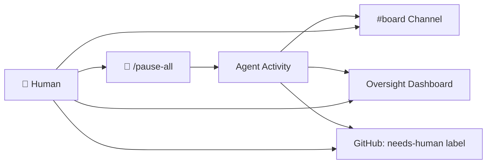

---

## 10. Next Steps

1. **Approve this plan** — Human reviews and provides feedback
2. **Create Slack workspace** — Set up channels, install bot
3. **Bootstrap Phase 1** — Start with orchestrator + CEO + CTO + 1 Engineer
4. **First autonomous cycle** — Let the crew plan and execute their first task
